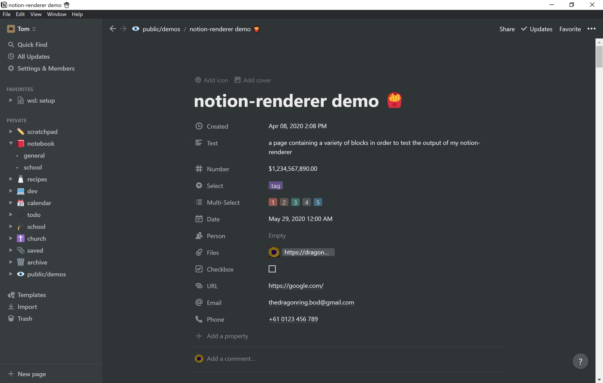
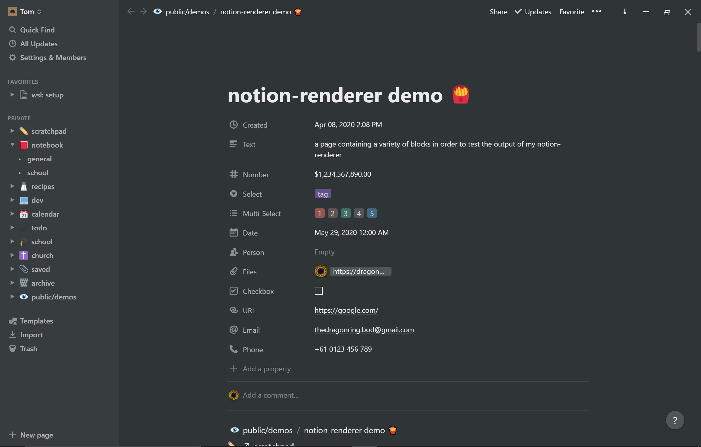
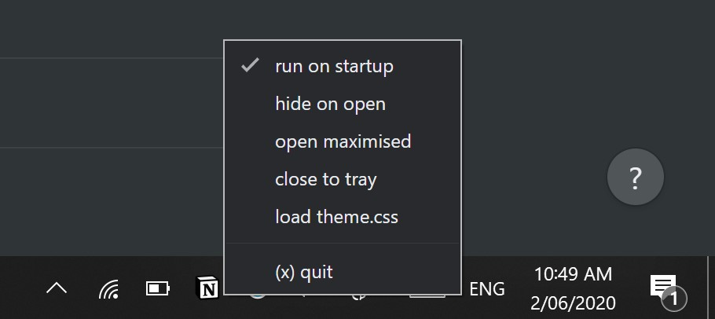

# notion enhancer

an enhancer/customiser for the all-in-one productivity workspace [notion.so](https://www.notion.so/)

_note: this is currently an unreleased version of the enhancer, which adds some cool things like colour theming and improves on some existing features. it is stable, and so has been pushed out for use. once i've done some more fine-tuning and finished taking screenshots of everything i will release this officially as v0.6.0._

## installation

currently, both win10 and Linux are supported. it is possible to run this script via the wsl to modify the win10 notion app.

For Linux install notion from [here](https://github.com/jaredallard/notion-app). Or if you're using arch install [notion-app](https://aur.archlinux.org/packages/notion-app/) package from AUR.

(the [styles](#styling) should also work for the web version.
these can be installed via an extension like [stylus](https://chrome.google.com/webstore/detail/stylus/clngdbkpkpeebahjckkjfobafhncgmne?hl=en)
or a built-in feature like [userChrome.css](https://www.userchrome.org/).)

1. install [node.js](https://nodejs.org/en/) (if using the wsl, it is recommended to install via [nvm](https://github.com/nvm-sh/nvm#install--update-script)).
2. install [python](https://www.python.org/) (if using the wsl, follow [this guide](https://docs.python-guide.org/starting/install3/linux/)).
3. reboot.
4. in cmd (on windows) or bash (with wsl), run `npm install -g asar` (check installation by running `asar`).
5. [download this enhancer](https://github.com/dragonwocky/notion-enhancer/archive/master.zip) & extract to a location it can safely remain (this must be in the windows filesystem,
   even if you are running the script from the wsl).
6. ensure notion is closed.
7. optional: to remove previous applications of the notion enhancer, run `cleaner.py`
8. optional: modify the `resources/user.css` file to your liking (see [styling](#styling)).
9. run `customiser.py` to build changes. (for linux run with sudo)

done: run notion and enjoy.

**oh no, now my app won't open!**

1. kill any notion tasks in the task manager (`ctrl+shift+esc`).
2. run `cleaner.py`.
3. reboot.
4. follow instructions above (ensuring notion _isn't_ running! again, check task manager).

**i tried opening the python file but it just closed instantly and nothing happened?**

python scripts must be run from the wsl terminal or windows command prompt via e.g. `python customiser.py`.

**now that i've run the script, can i delete this folder?**

no! user style files `resources/user.css` and `resources/theme.css` are fetched from here each time you open notion.
additionally, if you ever need to change or reset your notion build, the `customiser.py` and `cleaner.py` files will be useful.

unless you're sure you know what you're doing (if you have to ask, you probably don't) then do not delete anything.

## features

### titlebar

default windows titlebar/frame has been replaced by one more fitting to the theme of the app.

this includes the addition of an extra button, "always on top"
symbolised with an arrow (4th from the right). when toggled to point up,
notion will remain the top visible window even if not focused.

to customise which characters are used for these buttons, open in the `resources/preload.js` file,
find the relevant button (read the comments) and replace its icon with your chosen unicode character (e.g.
replacing `element.innerHTML = '⨉';` with `element.innerHTML = '🙄';`).

### nicer scrollbars

i mean, yeah. get rid of those ugly default scrollbars and use nice inconspicuous
ones that actually look as if they're part of notion.

to add these to the web version, copy lines 44 - 75 from `user.css` into your css customiser.

_image: before enhancement_

_image: after default enhancement_

### hotkeys

- **reload window**: in addition to the built-in `CmdOrCtrl+R` reload,
  you can now reload a window with `F5`.
- **toggle all notion windows to/from the tray**: `CmdOrCtrl+Shift+A` by default.

to set your own toggle hotkey, open `customiser.py` and change line 19 (`hotkey = 'CmdOrCtrl+Shift+A'`)
to your preference. you will need to run or re-run `customiser.py` afterwards.

### tray

single-click to toggle app visibility. right click to open menu.

settings will be saved in `%localappdata%/Programs/Notion/resources/app/user-preferences.json`

- **run on startup**: run notion on boot/startup. (default: true)
- **hide on open**: hide the launch of notion to the tray. (default: false)
- **open maximised**: maximise the app on open. (default: false)
- **close to tray**: close window to tray rather than closing outright
  on click of `⨉`. does not apply if multiple notion windows are open. (default: false)
- **load theme.css**: loads the custom colour theme file.
  see [colour theming](STYLING.md#colour-theming) for more information. (default: false)

_image: open application tray_

## styling

custom appearances can be applied to the app via the `resources/user.css` and `resources/theme.css` files. for more information,
and a list of various optional styling changes, see [the page on styling](STYLING.md).

## this is a fork

credit where credit is due, this was originally made by Uzver (github: [@TarasokUA](https://github.com/TarasokUA),
telegram: [UserFromUkraine](https://t.me/UserFromUkraine), discord: Uzver#8760).

he has approved my go-ahead with this fork, as he himself no longer wishes to continue development on the project.

## other details

the notion logo belongs entirely to the notion team, and was sourced from their
[media kit](https://www.notion.so/Media-Kit-205535b1d9c4440497a3d7a2ac096286).

if you have any questions, check [my website](https://dragonwocky.me/) for contact details.
